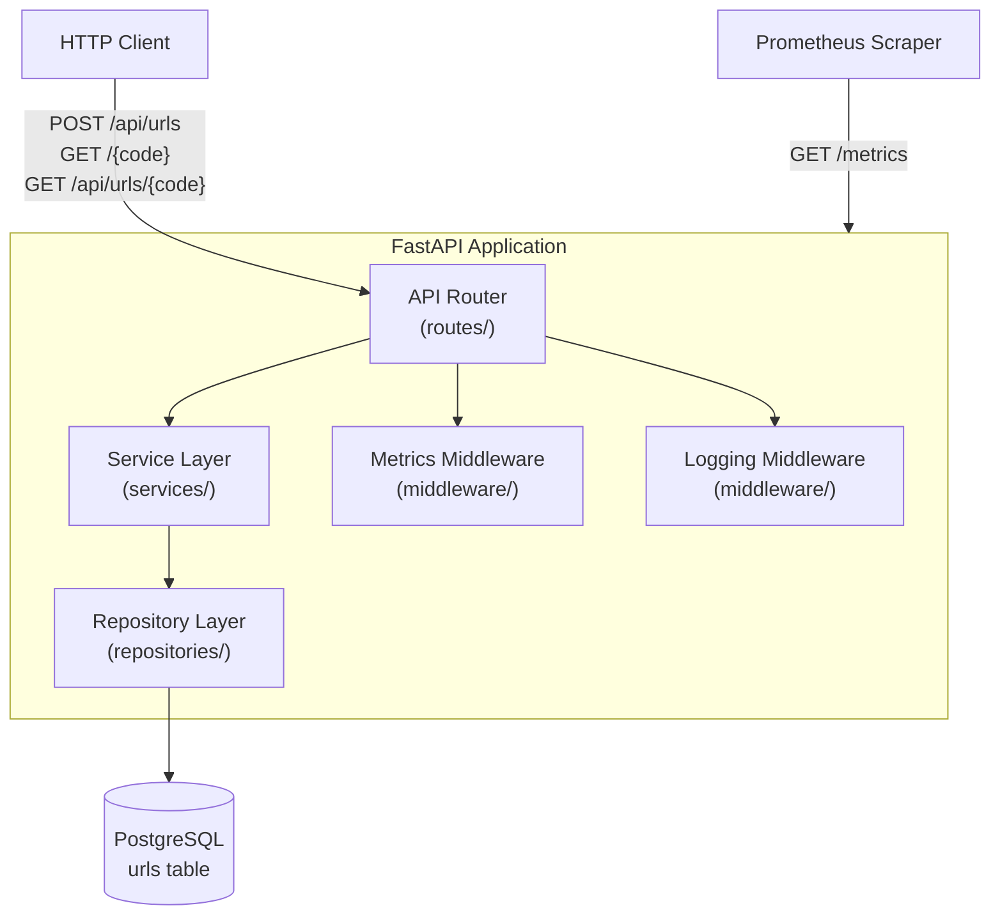

# Design Document

## URL Shortener

---

## Overview

The URL Shortener is a minimal, production-oriented REST API built with **FastAPI** and **PostgreSQL**. It accepts a long URL, persists it, and returns a short code that redirects visitors to the original destination. The service is stateless, fully configured through environment variables, containerized with Docker, and exposes Prometheus metrics for observability.

The design prioritizes:
- **Simplicity** — small surface area, minimal dependencies
- **Correctness** — strong validation, safe error responses, no data leakage
- **Observability** — structured logging, Prometheus metrics from day one
- **Deployability** — single container, environment-variable configuration, Alembic-managed schema

This document covers the architecture, components, data model, correctness properties, error handling, and testing strategy for the V1 implementation.

---

## Architecture

The application follows a layered architecture with clear separation between transport (HTTP), business logic (service layer), and persistence (repository layer). All layers communicate through typed interfaces.



### Request Flow

1. An incoming HTTP request passes through the **logging middleware** and **metrics middleware**.
2. FastAPI routes the request to the appropriate **endpoint function** in the router layer.
3. The router delegates business logic to the **service layer**, which contains URL validation, short code generation, and retry logic.
4. The service layer calls the **repository layer** for all database operations.
5. The response is built in the router and returned to the client.
6. The logging and metrics middleware record the result before the response is sent.

### Technology Choices

| Concern | Choice | Rationale |
|---|---|---|
| Web framework | FastAPI | Async-native, auto-generates OpenAPI docs, Pydantic validation built in |
| Database | PostgreSQL | Reliable, BIGSERIAL for IDs, UNIQUE index for short codes |
| ORM / query layer | SQLAlchemy Core (async) | Fine-grained control, no ORM magic, compatible with async drivers |
| Migrations | Alembic | Standard Python migration tool, keeps schema versioned |
| Metrics | `prometheus-client` | Official Python client, WSGI/ASGI middleware available |
| Containerization | Docker + uvicorn | Lightweight production server, standard Python image |
| Testing | pytest + pytest-asyncio + httpx | Standard async-capable test stack for FastAPI |
| PBT library | Hypothesis | Mature, integrates with pytest, rich strategy library |

---

## Components and Interfaces

### Directory Structure

```
app/
├── main.py                # FastAPI app factory, middleware registration
├── config.py              # Pydantic Settings — reads env vars
├── database.py            # Async SQLAlchemy engine + session factory
├── models.py              # SQLAlchemy table definition
├── schemas.py             # Pydantic request/response models
├── middleware/
│   ├── logging.py         # Structured request/response logging
│   └── metrics.py         # Prometheus metrics middleware
├── routes/
│   ├── urls.py            # POST /api/urls, GET /api/urls/{short_code}
│   ├── redirect.py        # GET /{short_code}
│   └── health.py          # GET /health, GET /ready
├── services/
│   └── url_service.py     # Short code generation, URL validation, creation logic
└── repositories/
    └── url_repository.py  # All database queries for URLs

alembic/
├── env.py
├── script.py.mako
└── versions/
    └── 0001_initial_schema.py

tests/
├── conftest.py            # Test DB setup, async client fixture
├── test_url_creation.py
├── test_redirect.py
├── test_lookup.py
├── test_health.py
├── test_metrics.py
└── properties/
    ├── test_short_code_properties.py
    ├── test_url_lifecycle_properties.py
    └── test_error_properties.py
```

### Key Interfaces

#### `config.py` — Settings

```python
class Settings(BaseSettings):
    database_url: str
    base_url: str
    log_level: str = "INFO"

    model_config = SettingsConfigDict(env_file=".env", extra="ignore")
```

All values are read from environment variables. No defaults exist for `DATABASE_URL` or `BASE_URL` — missing values raise a startup error.

#### `schemas.py` — Pydantic Models

```python
class URLCreateRequest(BaseModel):
    url: AnyHttpUrl          # Validates HTTP/HTTPS scheme automatically

class URLResponse(BaseModel):
    id: int
    short_code: str
    url: str
    short_url: str
    created_at: datetime

class URLDetailResponse(URLResponse):
    clicks: int
```

Using `AnyHttpUrl` from Pydantic V2 enforces the HTTP/HTTPS scheme constraint at the framework level. FastAPI returns HTTP 422 automatically for validation failures.

#### `services/url_service.py` — Service Layer

```python
class URLService:
    def __init__(self, repository: URLRepository, base_url: str): ...

    async def create_short_url(self, original_url: str) -> URLRecord:
        """Generates a unique short code with retry, persists, returns record."""

    def generate_short_code(self, length: int = None) -> str:
        """Returns a cryptographically random URL-safe string, length 6–8."""
```

`generate_short_code` generates an exactly 8-character short code using Python's cryptographically secure `secrets` module and an explicit URL-safe alphanumeric alphabet (`A-Z`, `a-z`, `0-9`). The generated code MUST contain exactly 8 characters and MUST NOT contain ambiguous padding or truncated `token_urlsafe` output.

The database enforces uniqueness on `short_code`. URL creation generates a code, attempts to insert the record, and catches a database unique-constraint violation if a collision occurs. In that case, it generates a new code and retries, up to a maximum of 10 attempts before raising an internal error that is returned as HTTP 500.

#### `repositories/url_repository.py` — Repository Layer

```python
class URLRepository:
    def __init__(self, session: AsyncSession): ...

    async def create(self, short_code: str, original_url: str) -> URLRecord: ...
    async def get_by_short_code(self, short_code: str) -> URLRecord | None: ...
    async def increment_clicks(self, short_code: str) -> None: ...
```

All methods are `async`. The repository raises domain exceptions (not SQLAlchemy internals) that the service and route layers handle.

#### `middleware/metrics.py` — Metrics Middleware

Implemented as a Starlette `BaseHTTPMiddleware` subclass. Intercepts each request, records start time, calls `await call_next(request)`, then increments counters and records histogram duration. Excludes `/metrics`, `/health`, and `/ready` paths from `http_requests_total` and `http_request_duration_seconds`.

#### `middleware/logging.py` — Logging Middleware

Also a `BaseHTTPMiddleware` subclass. Emits a structured log line per request containing: `timestamp`, `level`, `method`, `path`, `status_code`, `duration_ms`. Uses Python's `logging` module with a JSON formatter. Does not log request bodies, credentials, or short codes embedded in paths.

### Application Lifecycle

The application SHALL support graceful shutdown.

On application shutdown, the application SHALL:

Stop accepting new requests.
Allow in-flight requests to complete according to the server's graceful shutdown behavior.
Dispose of the SQLAlchemy database connection pool cleanly.

The application SHALL NOT require persistent application state to be stored in the container filesystem.

This behavior is important for safe container and Kubernetes pod termination.

---

## Data Models

### Database Schema

```sql
CREATE TABLE urls (
    id           BIGSERIAL PRIMARY KEY,
    short_code   VARCHAR(8) NOT NULL,
    original_url TEXT        NOT NULL,
    created_at   TIMESTAMPTZ NOT NULL DEFAULT NOW(),
    clicks       BIGINT      NOT NULL DEFAULT 0,
    CONSTRAINT uq_urls_short_code UNIQUE (short_code)
);
```

Managed exclusively through an Alembic migration (`0001_initial_schema.py`). The application never calls `Base.metadata.create_all()` in production code paths.

### SQLAlchemy Table Object

```python
urls_table = Table(
    "urls",
    metadata,
    Column("id",           BigInteger, primary_key=True, autoincrement=True),
    Column("short_code",   String(8), nullable=False, unique=True),
    Column("original_url", Text,       nullable=False),
    Column("created_at",   DateTime(timezone=True), server_default=func.now(), nullable=False),
    Column("clicks",       BigInteger, nullable=False, server_default="0"),
)
```

### Python Data Transfer Object

```python
@dataclass
class URLRecord:
    id: int
    short_code: str
    original_url: str
    created_at: datetime
    clicks: int
```

### API Response Shapes

**POST /api/urls → 201**
```json
{
  "id": 1,
  "short_code": "aB82xK",
  "url": "https://example.com/very/long/path",
  "short_url": "http://localhost:8000/aB82xK",
  "created_at": "2024-01-15T10:30:00Z"
}
```

**GET /api/urls/{short_code} → 200**
```json
{
  "id": 1,
  "short_code": "aB82xK",
  "url": "https://example.com/very/long/path",
  "short_url": "http://localhost:8000/aB82xK",
  "created_at": "2024-01-15T10:30:00Z",
  "clicks": 42
}
```

**GET /{short_code} → 302**
```
Location: https://example.com/very/long/path
```

**Error Response (all error cases)**
```json
{"detail": "..."}
```

### Prometheus Metrics

| Metric | Type | Labels | Description |
|---|---|---|---|
| `http_requests_total` | Counter | method, path, status | Total HTTP requests (excludes /metrics, /health, /ready) |
| `http_request_duration_seconds` | Histogram | method, path, status | Request duration in seconds (excludes /metrics, /health, /ready) |
| `url_shortener_urls_created_total` | Counter | — | Total URLs shortened |
| `url_shortener_redirects_total` | Counter | — | Total successful redirects |
| `url_shortener_errors_total` | Counter | — | Total error responses |

---

## Correctness Properties

*A property is a characteristic or behavior that should hold true across all valid executions of a system — essentially, a formal statement about what the system should do. Properties serve as the bridge between human-readable specifications and machine-verifiable correctness guarantees.*

### Property 1: Short Code Format Invariant

*For any* invocation of the short code generator, the result is a string of exactly 8 characters, and every character is an ASCII alphanumeric character (A-Z, a-z, or 0-9).

**Validates: Requirements 1.2**

---

### Property 2: Short Code Uniqueness After Retry

*For any* set of pre-existing short codes in the database, the URL creation service returns a short code that is not a member of that pre-existing set.

**Validates: Requirements 1.3**

---

### Property 3: URL Creation Response Completeness

*For any* valid HTTP or HTTPS URL submitted to `POST /api/urls`, the response contains all required fields (`id`, `short_code`, `url`, `short_url`, `created_at`) with non-null values, and `short_url` is the concatenation of `BASE_URL` and `/` and `short_code`.

**Validates: Requirements 1.1**

---

### Property 4: Input Validation Rejects Non-HTTP/HTTPS URLs

*For any* URL string whose scheme is not `http` or `https` (including `ftp://`, `javascript:`, `mailto:`, arbitrary strings, or empty input), submitting it to `POST /api/urls` always returns HTTP 422.

**Validates: Requirements 1.4, 1.5**

---

### Property 5: Redirect Round-Trip

*For any* valid URL that has been shortened, issuing a `GET /{short_code}` request always returns HTTP 302 with a `Location` header equal to the exact original URL that was submitted.

**Validates: Requirements 2.1**

---

### Property 6: Click Count Accumulation

*For any* short URL accessed N times sequentially, the `clicks` field returned by `GET /api/urls/{short_code}` equals N.
*For any* short URL accessed N times, including concurrent accesses, the `clicks` field returned by `GET /api/urls/{short_code}` increases by exactly N, assuming all redirect requests complete successfully.

The click counter MUST be incremented atomically at the database level (for example, using `clicks = clicks + 1` in a single SQL `UPDATE` statement). Concurrent redirects MUST NOT result in lost click increments.

**Validates: Requirements 2.2**

---

### Property 7: Metadata Round-Trip

*For any* URL creation response, a subsequent `GET /api/urls/{short_code}` using the returned `short_code` returns HTTP 200 with `short_code`, `url`, and `short_url` values identical to those in the creation response, plus a `clicks` field.

**Validates: Requirements 3.1**

---

### Property 8: 404 for Non-Existent Short Codes

*For any* string that has not been registered as a short code, both `GET /{short_code}` and `GET /api/urls/{short_code}` return HTTP 404 with the JSON body `{"detail": "Short URL not found"}`.

**Validates: Requirements 2.3, 3.2**

---

### Property 9: Metric Label Cardinality Invariant

*For any* HTTP request processed by the application, the metric entry recorded in `http_requests_total` and `http_request_duration_seconds` contains exactly the labels `method`, `path`, and `status`, with no additional label dimensions.

**Validates: Requirements 5.4**

---

### Property 10: Safe Error Responses

*For any* unhandled server-side exception, the HTTP response is 500 with a body of exactly `{"detail": "Internal server error"}`, and the response body contains no Python stack trace, no SQL error text, and no database connection details.

**Validates: Requirements 9.1**

---

### Property 11: Request Log Completeness

*For any* HTTP request processed by the application, the emitted log entry contains all of: timestamp, log level, HTTP method, path, response status code, and request duration.

**Validates: Requirements 8.2**

---

## Error Handling

### HTTP Status Code Mapping

| Scenario | Status | Response Body |
|---|---|---|
| URL created successfully | 201 | `URLResponse` JSON |
| Redirect found | 302 | `Location` header |
| Resource not found | 404 | `{"detail": "Short URL not found"}` |
| Validation failure (invalid URL, missing field) | 422 | FastAPI default validation error JSON |
| Unhandled server error | 500 | `{"detail": "Internal server error"}` |
| Database unreachable (readiness) | 503 | `{"status": "not_ready"}` |

### Global Exception Handler

A FastAPI `exception_handler` for `Exception` catches all unhandled errors, logs the full traceback at `ERROR` level internally (not in the response), increments `url_shortener_errors_total`, and returns the sanitized 500 response. This prevents leaking SQLAlchemy exceptions, tracebacks, or connection strings to clients.

### Short Code Collision Handling

The service layer retries up to 10 times on `UniqueViolation`. If all 10 attempts fail (astronomically unlikely with a 6–8 character URL-safe alphabet), the service raises an internal error that is caught by the global handler and returned as HTTP 500.

### Database Connectivity

The repository layer does not swallow database connection errors on normal routes — these propagate up and are caught by the global exception handler. The `/ready` endpoint has its own try/except that maps connection failure to HTTP 503 explicitly.

### Input Validation

FastAPI + Pydantic handle all request validation. Using `AnyHttpUrl` for the URL field means scheme validation happens before the service layer is ever invoked. No custom validator is needed for the basic HTTP/HTTPS check.

---

## Testing Strategy

### Approach

The test suite uses a **dual testing approach**: example-based tests for specific behaviors and integration points, and property-based tests (using **Hypothesis**) for universal invariants. Together they provide comprehensive coverage without over-specifying concrete inputs.

The test database is a separate PostgreSQL instance (or a temporary schema within the same instance) created and destroyed per test session via pytest fixtures. No production or development data is touched.

### Test Infrastructure

**`tests/conftest.py`**:
- Creates an async SQLAlchemy engine pointed at the test database URL
- Runs Alembic migrations against the test database before the session
- Provides an `async_client` fixture (httpx `AsyncClient` wrapping the FastAPI app)
- Wraps each test in a transaction that is rolled back after the test (isolation without teardown overhead)

### Example-Based Tests

These cover specific scenarios, integration points, and edge cases:

| Test | Validates |
|---|---|
| `GET /health` → 200 `{"status": "ok"}` | Req 4.1 |
| `GET /ready` with DB available → 200 | Req 4.2 |
| `GET /ready` with DB unavailable → 503 | Req 4.3 |
| `POST /api/urls` with `https://example.com` → 201 | Req 1.1 |
| `POST /api/urls` with `ftp://bad` → 422 | Req 1.4 |
| `POST /api/urls` with empty body → 422 | Req 1.5 |
| `GET /{short_code}` → 302 with correct `Location` | Req 2.1 |
| `GET /nonexistent` → 404 | Req 2.3 |
| `GET /api/urls/{short_code}` → 200 with all fields | Req 3.1 |
| `GET /api/urls/nonexistent` → 404 | Req 3.2 |
| `/metrics` response includes all required metric names | Req 5.2, 5.3 |
| `/metrics`, `/health`, `/ready` excluded from `http_requests_total` | Req 5.5 |
| Simulated 500 returns safe body with no stack trace | Req 9.1 |

### Property-Based Tests (Hypothesis)

Hypothesis SHALL be used selectively for behaviors where generated inputs provide meaningful additional coverage.

Property-based tests SHOULD cover:

short-code format and character constraints;
URL validation across a broad range of generated inputs.

The core API lifecycle SHALL primarily be tested using conventional integration tests covering URL creation, redirection, click counting, lookup, error handling, health, readiness, and metrics.

Property-based testing is not required for every correctness property.

```python
# Tag format comment for each test:
# Feature: url-shortener, Property N: <property_text>
```

**`tests/properties/test_short_code_properties.py`**

- **Property 1** — Hypothesis generates arbitrary calls to `generate_short_code()`; asserts length in [6, 8] and all characters match `[A-Za-z0-9_-]`.

**`tests/properties/test_url_lifecycle_properties.py`**

- **Property 3** — Hypothesis generates valid `http://` and `https://` URLs (using `st.from_regex` or a custom strategy); asserts response 201 and all fields present with correct `short_url` structure.
- **Property 4** — Hypothesis generates URLs with arbitrary non-http/https schemes (and random non-URL strings); asserts response always 422.
- **Property 5** — Generates valid URLs, creates them via the API, then issues GET on the short code; asserts 302 and `Location == original_url`.
- **Property 6** — Generates a valid URL and a count N ∈ [1, 20]; creates the URL, issues N GET redirects, then checks `clicks == N` via the lookup endpoint.
- **Property 7** — Generates valid URLs; creates, then looks up; asserts `short_code`, `url`, `short_url` match and `clicks` field is present.
- **Property 8** — Hypothesis generates random strings unlikely to be valid short codes; asserts both redirect and lookup endpoints return 404 with exact body.

**`tests/properties/test_error_properties.py`**

- **Property 9** — After generating and issuing arbitrary valid requests, inspects Prometheus registry to assert all recorded entries for `http_requests_total` have exactly the labels `{method, path, status}`.
- **Property 10** — Uses a mock that raises unexpected exceptions in the service layer; asserts every response is 500 with the exact sanitized body.
- **Property 11** — Captures log output during arbitrary valid requests; asserts every emitted request log entry contains all required fields.

**Property 2** (short code uniqueness) is validated via example-based test with a mocked repository that simulates N collisions before succeeding; the returned code is verified to differ from all pre-existing codes. A property variant can generate arbitrary collision sequences.

### Configuration for Property Tests

```python
from hypothesis import settings, HealthCheck

@settings(
    max_examples=100,
    suppress_health_check=[HealthCheck.too_slow],
)
```

Each property test file imports a shared `settings` profile. The minimum of 100 examples is enforced. For async tests, `pytest-asyncio` and the `anyio` backend are used alongside Hypothesis's async support.

### Smoke Tests

Single-execution checks for infrastructure and setup:
- Database schema matches requirement (column names, types, constraints) — inspected via SQLAlchemy reflection
- All required Prometheus metric names present in `/metrics` output
- Application starts without hardcoded secrets (verified by grepping source for known patterns in CI)
- `.env.example` file exists and lists all required variables
